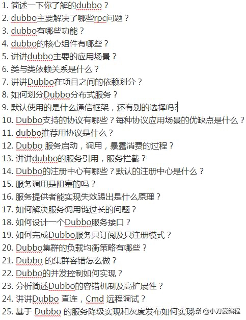
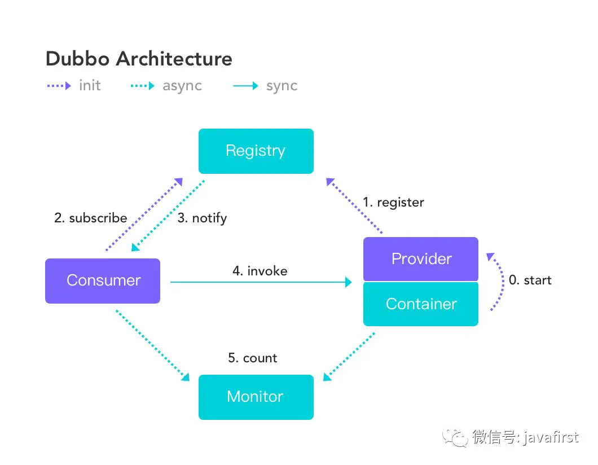

一、Dubbo是什么？
Dubbo是阿里巴巴开源的基于 Java 的高性能 RPC（一种远程调用） 分布式服务框架（SOA），致力于提供高性能和透明化的RPC远程服务调用方案，以及SOA服务治理方案。
二、为什么要用Dubbo？
因为是阿里开源项目，国内很多互联网公司都在用，已经经过很多线上考验。内部使用了 Netty、Zookeeper，保证了高性能高可用性。

1、使用Dubbo可以将核心业务抽取出来，作为独立的服务，逐渐形成稳定的服务中心，可用于提高业务复用
灵活扩展，使前端应用能更快速的响应多变的市场需求。
2、分布式架构可以承受更大规模的并发流量。
三、Dubbo 和 Spring Cloud 有什么区别？

1、通信方式不同：Dubbo 使用的是 RPC 通信，而Spring Cloud 使用的是HTTP RESTFul 方式。
2、组成不一样：
dubbo的服务注册中心为Zookeerper，服务监控中心为dubbo-monitor,无消息总线，服务跟踪、批量任务等组件；
spring-cloud的服务注册中心为spring-cloud netflix  enruka，服务监控中心为spring-boot admin,有消息总线，数据流、服务跟踪、批量任务等组件；
四、Dubbo需要 Web 容器吗？
不需要，如果硬要用Web 容器，只会增加复杂性，也浪费资源。
五、Dubbo内置了哪几种服务容器？

三种服务容器：
1、Spring Container
2、Jetty Container
3、Log4j Container
Dubbo 的服务容器只是一个简单的 Main 方法，并加载一个简单的 Spring 容器，用于暴露服务。
六、dubbo都支持什么协议，推荐用哪种？

1、dubbo://（推荐）
2、http://
3、rest://
4、redis://
5、memcached://
七、Dubbo里面有哪几种节点角色？

1、provide：暴露服务的服务提供方
2、consumer：调用远程服务的服务消费方
3、registry:服务注册于发现的注册中心
4、monitor:统计服务调用次数和调用时间的监控中心
5、container:服务运行容器
八、dubbo服务注册与发现的流程图

dubbo服务注册与发现的流程图

九、Dubbo默认使用什么注册中心，还有别的选择吗？
推荐使用zookeeper作为注册中心，还有redis、multicast、simple注册中心。
十、Dubbo 核心的配置有哪些？

Dubbo 核心的配置

十一、在 Provider 上可以配置的 Consumer 端的属性有哪些？
1、timeout：方法调用超时
2、retries：失败重试次数，默认重试 2 次
3、loadbalance：负载均衡算法，默认随机
4、actives 消费者端，最大并发调用限制
十二、Dubbo有哪几种负载均衡策略，默认是哪种？

1、random loadbalance：安权重设置随机概率（默认）；
2、roundrobin loadbalance：轮寻，按照公约后权重设置轮训比例；
3、lastactive loadbalance：最少活跃调用数，若相同则随机；
4、consistenthash loadbalance：一致性hash，相同参数的请求总是发送到同一提供者。
十三、Dubbo启动时如果依赖的服务不可用会怎样？
Dubbo缺省会在启动时检查依赖的服务是否可用，不可用时会抛出异常，阻止 Spring 初始化完成，默认
check="true"，可以通过 check="false" 关闭检查。
十四、Dubbo推荐使用什么序列化框架，你知道的还有哪些？

推荐使用Hessian序列化，还有Duddo、FastJson、Java自带序列化；
十五、Dubbo默认使用的是什么通信框架，还有别的选择吗？

Dubbo 默认使用 Netty 框架，也是推荐的选择，另外内容还集成有Mina、Grizzly。
十六、Dubbo有哪几种集群容错方案，默认是哪种？

Dubbo集群容错方案

十七、服务提供者能实现失效踢出是什么原理？

服务失效踢出基于zookeeper的临时节点原理。
十八、Dubbo服务之间的调用是阻塞的吗？

默认是同步等待结果阻塞的，支持异步调用。
Dubbo 是基于 NIO 的非阻塞实现并行调用，客户端不需要启动多线程即可完成并行调用多个远程服务，相对
多线程开销较小，异步调用会返回一个 Future 对象。
Dubbo暂时不支持分布式事务。
十九、Dubbo的管理控制台能做什么？

管理控制台主要包含：路由规则，动态配置，服务降级，访问控制，权重调整，负载均衡，等管理功能。
注：dubbo源码中的dubbo-admin模块打成war包，发布运行即可得到dubbo控制管理界面。
二十、Dubbo 服务暴露的过程

Dubbo 会在 Spring 实例化完 bean 之后，在刷新容器最后一步发布 ContextRefreshEvent 事件的时候，通知
实现了 ApplicationListener 的 ServiceBean 类进行回调 onApplicationEvent 事件方法，Dubbo 会在这个方法
中调用 ServiceBean 父类 ServiceConfig 的 export 方法，而该方法真正实现了服务的（异步或者非异步）发
布。
二十一、当一个服务接口有多种实现时怎么做？
当一个接口有多种实现时，可以用 group 属性来分组，服务提供方和消费方都指定同一个 group 即可。
二十一、服务上线怎么兼容旧版本？
可以用版本号（version）过渡，多个不同版本的服务注册到注册中心，版本号不同的服务相互间不引用。这
个和服务分组的概念有一点类似。
二十二、Dubbo 和 Dubbox 有什么区别？
Dubbox 是继 Dubbo 停止维护后，当当网基于 Dubbo 做的一个扩展项目，如加了服务可 Restful 调用，更新了开源组件等。
二十三、你觉得用 Dubbo 好还是 Spring Cloud 好？
扩展性的问题，没有好坏，只有适合不适合，我更倾向于使用 Dubbo, Spring Cloud 版本升级太快，组件更新替换太频繁，配置太繁琐。
二十四、出现调用超时com.alibaba.dubbo.remoting.TimeoutException异常怎么办？

通常是业务处理太慢，可在服务提供方执行：jstack PID > jstack.log 分析线程都卡在哪个方法调用上，这里就是慢的原因。
如果不能调优性能，请将timeout设大。 
二十五、出现java.util.concurrent.RejectedExecutionException或者Thread pool exhausted怎么办？

1、RejectedExecutionException表示线程池已经达到最大值，并且没有空闲连，拒绝执行了一些任务。 
2、Thread pool exhausted通常是min和max不一样大时，表示当前已创建的连接用完，进行了一次扩充，创建了新线程，但不影响运行。 
原因可能是连接池不够用，请调整dubbo.properites中的：
// 设成一样大，减少线程池收缩开销  
dubbo.service.min.thread.pool.size=200  
dubbo.service.max.thread.pool.size=200  

Dubbo源码使用了哪些设计模式
Dubbo中的设计模式
责任链模式

责任链模式在Dubbo中发挥的作用举足轻重，就像是Dubbo框架的骨架。Dubbo的调用链组织是用责任链模式串连起来的。责任链中的每个节点实现Filter接口，然后由ProtocolFilterWrapper，将所有Filter串连起来。Dubbo的许多功能都是通过Filter扩展实现的，比如监控、日志、缓存、安全、telnet以及RPC本身都是。如果把Dubbo比作一列火车，责任链就像是火车的各车厢，每个车厢的功能不同。如果需要加入新的功能，增加车厢就可以了，非常容易扩展。

观察者模式

Dubbo中使用观察者模式最典型的例子是RegistryService。消费者在初始化的时候回调用subscribe方法，注册一个观察者，如果观察者引用的服务地址列表发生改变，就会通过NotifyListener通知消费者。此外，Dubbo的InvokerListener、ExporterListener 也实现了观察者模式，只要实现该接口，并注册，就可以接收到consumer端调用refer和provider端调用export的通知。Dubbo的注册/订阅模型和观察者模式就是天生一对。

修饰器模式

Dubbo中还大量用到了修饰器模式。比如ProtocolFilterWrapper类是对Protocol类的修饰。在export和refer方法中，配合责任链模式，把Filter组装成责任链，实现对Protocol功能的修饰。其他还有ProtocolListenerWrapper、 ListenerInvokerWrapper、InvokerWrapper等。个人感觉，修饰器模式是一把双刃剑，一方面用它可以方便地扩展类的功能，而且对用户无感，但另一方面，过多地使用修饰器模式不利于理解，因为一个类可能经过层层修饰，最终的行为已经和原始行为偏离较大。

工厂方法模式

CacheFactory的实现采用的是工厂方法模式。CacheFactory接口定义getCache方法，然后定义一个AbstractCacheFactory抽象类实现CacheFactory，并将实际创建cache的createCache方法分离出来，并设置为抽象方法。这样具体cache的创建工作就留给具体的子类去完成。

抽象工厂模式

ProxyFactory及其子类是Dubbo中使用抽象工厂模式的典型例子。ProxyFactory提供两个方法，分别用来生产Proxy和Invoker（这两个方法签名看起来有些矛盾，因为getProxy方法需要传入一个Invoker对象，而getInvoker方法需要传入一个Proxy对象，看起来会形成循环依赖，但其实两个方式使用的场景不一样）。AbstractProxyFactory实现了ProxyFactory接口，作为具体实现类的抽象父类。然后定义了JdkProxyFactory和JavassistProxyFactory两个具体类，分别用来生产基于jdk代理机制和基于javassist代理机制的Proxy和Invoker。

适配器模式

为了让用户根据自己的需求选择日志组件，Dubbo自定义了自己的Logger接口，并为常见的日志组件（包括jcl, jdk, log4j, slf4j）提供相应的适配器。并且利用简单工厂模式提供一个LoggerFactory，客户可以创建抽象的Dubbo自定义Logger，而无需关心实际使用的日志组件类型。在LoggerFactory初始化时，客户通过设置系统变量的方式选择自己所用的日志组件，这样提供了很大的灵活性。

代理模式

Dubbo consumer使用Proxy类创建远程服务的本地代理，本地代理实现和远程服务一样的接口，并且屏蔽了网络通信的细节，使得用户在使用本地代理的时候，感觉和使用本地服务一样。