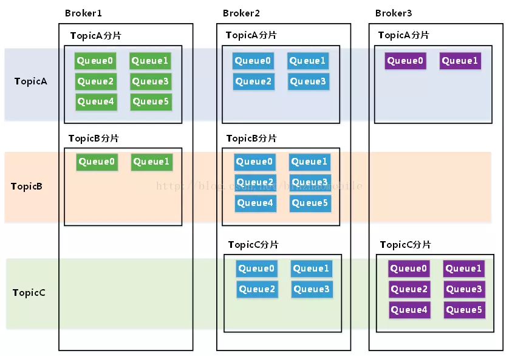

###RocketMQ消息消费方式 推拉模式
RocketMQ消息消费本质上是基于的拉（pull）模式，consumer主动向消息服务器broker拉取消息。
consumer被分为2类：MQPullConsumer和MQPushConsumer，其实本质都是拉模式（pull），即consumer轮询从broker拉取消息。 区别：
MQPushConsumer方式，consumer把轮询过程封装了，并注册MessageListener监听器，取到消息后，唤醒MessageListener的consumeMessage()
来消费，对用户而言，感觉消息是被推送（push）过来的。主要用的也是这种方式。
MQPullConsumer方式，取消息的过程需要用户自己写，首先通过打算消费的Topic拿到MessageQueue的集合，遍历MessageQueue集合，然后针对每
个MessageQueue批量取消息，一次取完后，记录该队列下一次要取的开始offset，直到取完了，再换另一个MessageQueue。
 
数据交互有两种模式：Push（推模式）、Pull（拉模式）。真正的PUSH和PULL的区别：
推模式指的是客户端与服务端建立好网络长连接，服务方有相关数据，直接通过长连接通道推送到客户端。其优点是及时，一旦有数据变更，客户端立马能
感知到；另外对客户端来说逻辑简单，不需要关心有无数据这些逻辑处理。缺点是不知道客户端的数据消费能力，可能导致数据积压在客户端，来不及处理。
拉模式指的是客户端主动向服务端发出请求，拉取相关数据。其优点是此过程由客户端发起请求，故不存在推模式中数据积压的问题。缺点是可能不够及时
，对客户端来说需要考虑数据拉取相关逻辑，何时去拉，拉的频率怎么控制等等。
拉模式中，为了保证消息消费的实时性，采取了长轮询消息服务器拉取消息的方式。每隔一定时间，客户端想服务端发起一次请求，服务端有数据就返回数
据，服务端如果此时没有数据，保持连接。等到有数据返回（相当于一种push），或者超时返回。
长轮询Pull的好处就是可以减少无效请求，保证消息的实时性，又不会造成客户端积压。
目前绝大部分的MQ都是基于的PULL模式。

Rocketmq 之Topic，Topic分片和Queue

如下图：

lockdreamer

从本质上来说，RocketMQ中的Queue是数据分片的产物。为了更好地理解Queue的定义，我们还需要引入一个新的概念：Topic分片。在分布式数据库和分布式缓存领域，分片概念已经有了清晰的定义。同理，对于RocketMQ，一个Topic可以分布在各个Broker上，我们可以把一个Topic分布在一个Broker上的子集定义为一个Topic分片。对应上图，TopicA有3个Topic分片，分布在Broker1,Broker2和Broker3上，TopicB有2个Topic分片，分布在Broker1和Broker2上，TopicC有2个Topic分片，分布在Broker2和Broker3上。

将Topic分片再切分为若干等分，其中的一份就是一个Queue。每个Topic分片等分的Queue的数量可以不同，由用户在创建Topic时指定。

我们知道，数据分片的主要目的是突破单点的资源（网络带宽，CPU，内存或文件存储）限制从而实现水平扩展。RocketMQ 在进行Topic分片以后，已经达到水平扩展的目的了，为什么还需要进一步切分为Queue呢？

解答这个问题还需要从负载均衡说起。以消息消费为例，借用Rocket MQ官方文档中的Consumer负载均衡示意图来说明：

lockdreamer

如图所示，TOPIC_A在一个Broker上的Topic分片有5个Queue，一个Consumer Group内有2个Consumer按照集群消费的方式消费消息，按照平均分配策略进行负载均衡得到的结果是：第一个 Consumer 消费3个Queue，第二个Consumer 消费2个Queue。如果增加Consumer，每个Consumer分配到的Queue会相应减少。Rocket MQ的负载均衡策略规定：Consumer数量应该小于等于Queue数量，如果Consumer超过Queue数量，那么多余的Consumer 将不能消费消息。

在一个Consumer Group内，Queue和Consumer之间的对应关系是一对多的关系：一个Queue最多只能分配给一个Consumer，一个Cosumer可以分配得到多个Queue。这样的分配规则，每个Queue只有一个消费者，可以避免消费过程中的多线程处理和资源锁定，有效提高各Consumer消费的并行度和处理效率。

    由此，我们可以给出Queue的定义：

    Queue是Topic在一个Broker上的分片等分为指定份数后的其中一份，是负载均衡过程中资源分配的基本单元。